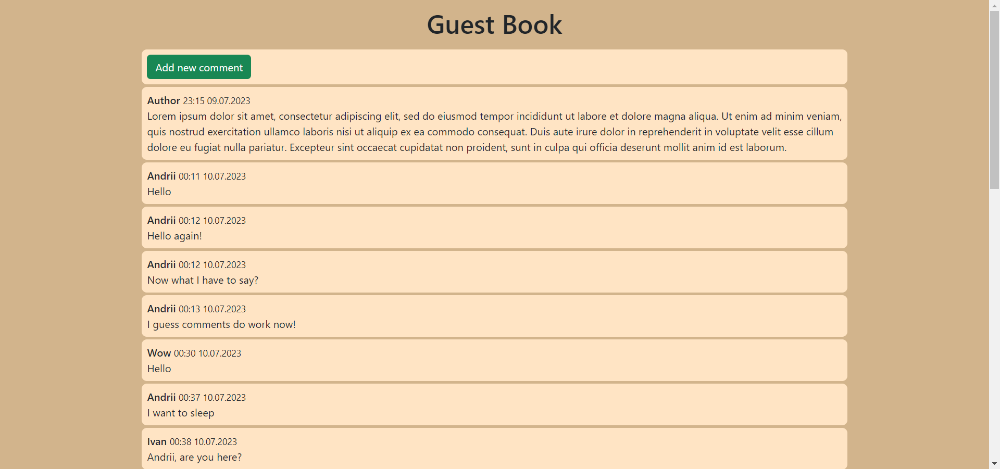
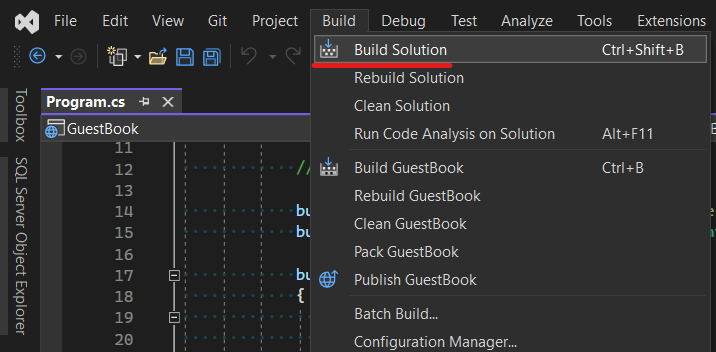
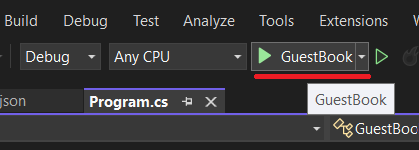

# Guest Book 

Guest book is an application that provides the possibility of writing comments on a site. It is the one-paged site where everyone can see comments and add new ones.



## Usage on your system

### Prerequisites

To successfully launch Guest Book app, you should have these applications installed:
* Visual Studio 2022 (for backend)
* Visual Studio Code (for frontend)
* Node.js (for frontend)

### Setting up the app

Download this project manually or using `git clone`:

```sh
git clone https://github.com/AndrryArmor/GuestBook.git
```

It will create a `GuestBook` folder with app's content inside.

#### Setting up the backend

Open the backend solution `GuestBook/Backend/GuestBook.sln` in Visual Studio and build it.

This will install all necessary NuGet packages for the project.

Open Package Manager Console (`Tools > NuGet Package Manager > Package Manager Console`) and run:

```sh
Update-Database
```

This command will apply the latest migration to create a GuestBook database to store data for the app.

#### Setting up the frontend

Open `GuestBook` folder in Visual Studio Code. Then, run next commands:

```sh
cd Frontend
npm install
```

This will install all node packages needed for the frontend.

### Runnning the app

#### Checking ports

The app relies on proper ports for backend and frontend to work correctly. Before running the app, ensure that backend is set up to run on port `7023` and frontend on port `8080`. 

To check backend port, see `GuestBook/Backend/Properties/launchSettings.json` file, search for `profiles/GuestBook/applicationUrl` setting. It should look similar to this: 

```json
"applicationUrl": "https://localhost:7023;http://localhost:5120"
```
Port of the `https` url must be set to `7023`, if not - correct it.

Frontend port can be found by the path `GuestBook/Frontend/vite.config.js`, search for setting `server/port`. It should look similar to this:

```js
server: {
    port: 8080,
  }
```

#### Running

To run backend, just start the solution:


It will automatically open a Swagger UI for backend API at `https://localhost:7023/swagger/index.html`

To run frontend, assuming you are at the `GuestBook/Frontent` folder in Visual Studio Code terminal, run this command:

```sh
npm run dev
```
Then, follow the link in the terminal. It must be this URL: `http://localhost:8080/`.